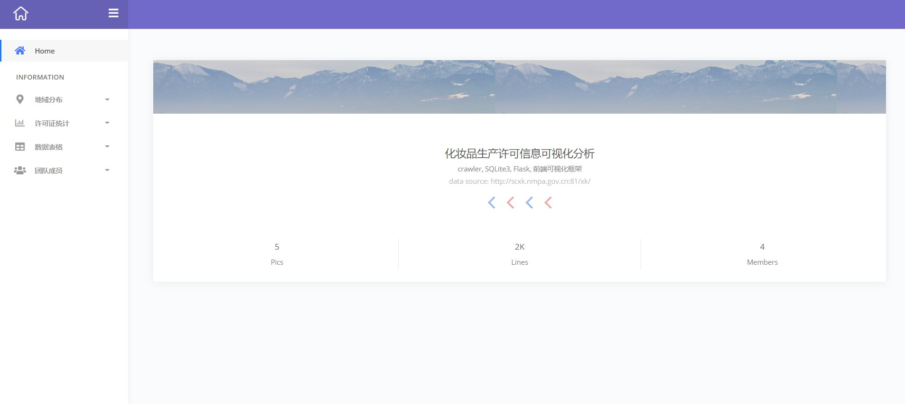
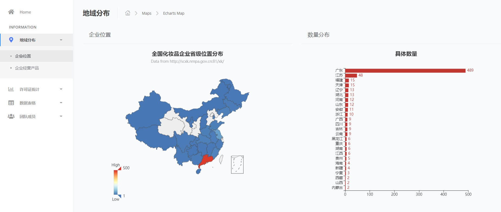

# 2020_project
## Python爬取化妆品许可证信息 使用flask框架可视化数据

##项目技术栈：`Flask框架、Echarts、爬虫、SQLite`
##环境：`Python3`

### 目录结构说明

├─static				    ----- 静态页面

├─templates				  ----- HTML页面

│  app.py				----- flask框架 文件

│  spider.py			----- 爬取数据 文件

│  dao.py				----- 数据库操作 文件

│  main.py				----- main入口 文件

│  cosmetic.db				----- 数据库

<<<<<<< HEAD
│  data.json				----- json格式保存的数据信息 文件

└─  README.md

### 步骤
- 运行main.py
  - 爬取数据
  - 在本地建立数据库并创建数据表
  - 写入数据到数据库
- 运行app.py，使用flask在本地创建服务器
- 打开网页选择模块
- 查看可视化结果

### 页面展示

